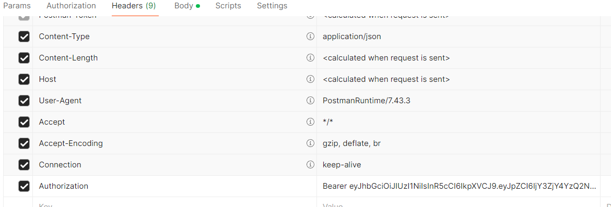

# ToDo App API 🚀

[](https://nodejs.org)
[](https://www.mongodb.com/)
[](LICENSE)

Una API RESTful robusta para gestión de tareas personales con sistema de autenticación y roles. Permite a los usuarios gestionar sus tareas mientras proporciona capacidades administrativas avanzadas para la gestión global del sistema.

## Características Principales

- Autenticación segura con JWT
- Sistema de roles (Usuario/Administrador)
- CRUD completo de tareas
- Protección de rutas por rol
- Gestión de usuarios (para administradores)
- Encriptación de contraseñas
- Validación de datos en tiempo real

## Requisitos Previos

- Node.js (v18 o superior)
- MongoDB (v5 o superior)
- npm (incluido con Node.js)

## Inicio Rápido

1. **Clonar el repositorio**
   ```bash
   git clone https://github.com/Geovani29/todo-app.git
   cd todo-app
   ```

2. **Instalar dependencias**
   ```bash
   npm install
   ```

3. **Configurar variables de entorno**
   ```bash
   # Crear archivo .env en la raíz del proyecto
   PORT=5000
   MONGODB_URI=mongodb://localhost:27017/todo-app
   JWT_SECRET=tu_clave_secreta_muy_segura
   JWT_EXPIRE=30d
   ```

4. **Iniciar el servidor**
   ```bash
   # Modo desarrollo
   npm run dev

   # Modo producción
   npm start
   ```

   El servidor estará disponible en `http://localhost:5000`

## 🏗️ Arquitectura

### Roles del Sistema

| Rol | Permisos |
|-----|----------|
| **Usuario** | - Gestión de tareas propias<br>- Actualización de perfil propio |
| **Administrador** | - Gestión global de tareas<br>- Gestión de usuarios<br>- Acceso total al sistema |

## Endpoints de Autenticación (Públicos)

| Método | Ruta | Descripción |
|--------|------|-------------|
| POST | /api/auth/register | Registrar un nuevo usuario |
| POST | /api/auth/login | Iniciar sesión |

## Funcionalidades para Usuarios Normales

Los usuarios normales pueden gestionar únicamente sus propias tareas:

### Endpoints de Tareas

| Método | Ruta | Descripción |
|--------|------|-------------|
| GET | /api/tasks | Obtener todas las tareas propias |
| GET | /api/tasks/:id | Obtener una tarea específica propia |
| POST | /api/tasks | Crear una nueva tarea |
| PUT | /api/tasks/:id | Actualizar una tarea propia |
| DELETE | /api/tasks/:id | Eliminar una tarea propia |

## Funcionalidades para Administradores

Los administradores tienen acceso completo a todas las tareas y usuarios del sistema:

### Endpoints de Tareas

| Método | Ruta | Descripción |
|--------|------|-------------|
| GET | /api/tasks | Obtener todas las tareas de todos los usuarios |
| GET | /api/tasks/:id | Obtener cualquier tarea del sistema |
| POST | /api/tasks | Crear una nueva tarea |
| PUT | /api/tasks/:id | Actualizar cualquier tarea del sistema |
| DELETE | /api/tasks/:id | Eliminar cualquier tarea del sistema |

### Endpoints de Usuarios

| Método | Ruta | Descripción |
|--------|------|-------------|
| GET | /api/users | Obtener todos los usuarios |
| GET | /api/users/:id | Obtener un usuario específico |
| PUT | /api/users/:id | Actualizar un usuario |
| DELETE | /api/users/:id | Eliminar un usuario |

## Ejemplos de Uso

### Registrar un usuario
POST /api/auth/register
Content-Type: application/json
{
"name": "Usuario Normal",
"email": "usuario@test.com",
"password": "123456"
}

### Iniciar sesión
POST /api/auth/login
Content-Type: application/json
{
"email": "usuario@test.com",
"password": "123456"
}


Respuesta:
{
"success": true,
"token": "eyJhbGciOiJIUzI1NiIsInR5cCI6IkpXVCJ9..."
}

### Crear una tarea
POST /api/tasks
Authorization: Bearer TU_TOKEN

Content-Type: application/json
{
"title": "Mi tarea",
"description": "Descripción de la tarea",
"dueDate": "2023-12-31"
}

### Obtener todas las tareas
GET /api/tasks
Authorization: Bearer TU_TOKEN

### Actualizar una tarea
PUT /api/tasks/:id
Authorization: Bearer TU_TOKEN
Content-Type: application/json
{
"status": "en progreso"
}

### Eliminar una tarea
DELETE /api/tasks/:id
Authorization: Bearer TU_TOKEN


## Modelo de Datos

### Usuario
- nombre
- email
- contraseña (encriptada)
- rol (user/admin)
- fecha de creación

### Tarea
- título
- descripción
- estado (pendiente/en progreso/completada)
- fecha límite
- propietario (id del usuario)
- fecha de creación

## 🔒 Seguridad

- **Autenticación**: Implementación de JSON Web Tokens (JWT)
- **Encriptación**: Contraseñas aseguradas con bcryptjs
- **Autorización**: Middleware de verificación de roles
- **Validación**: Sanitización y validación de datos en cada endpoint
- **Headers**: Implementación de headers de seguridad
- **Rate Limiting**: Protección contra ataques de fuerza bruta

## 📝 Licencia

Este proyecto está bajo la Licencia MIT - ver el archivo [LICENSE](LICENSE) para más detalles.

## 🤝 Contribuir

Las contribuciones son bienvenidas. Por favor, abre un issue primero para discutir los cambios que te gustaría hacer.

---

Desarrollado con ❤️ por [Tu Nombre](https://github.com/tuusuario)